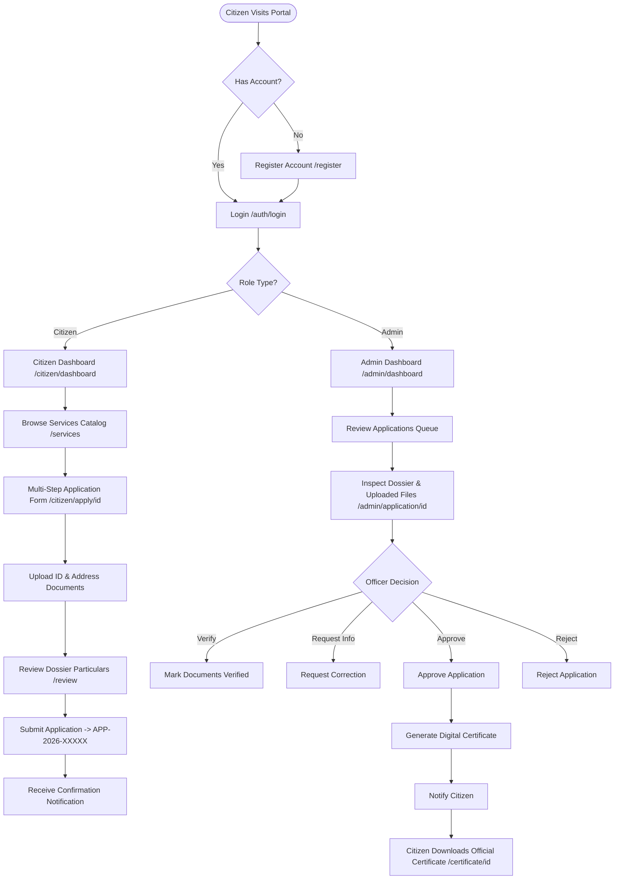

# WEEK 2 EVALUATION REVISION REPORT: DESIGN RATIONALE, WIREFRAMES & USER FLOWS

**Project Name:** Digital Citizen Service Portal  
**Role:** Junior Web Developer – E-Governance & Digital Services  
**Tech Stack:** Python 3.13, Flask, SQLite with SQLAlchemy ORM, Bootstrap 5.3, HTML5, CSS3, JavaScript  

---

## 1. Executive Summary & Design Overview
The **Digital Citizen Service Portal** is a centralized e-governance platform built to digitize public service delivery. The portal provides citizens with a paperless experience to request official state certificates, track application dossiers in real time, file grievances, and download digitally signed certificates upon approval. It includes a dedicated administrative console for nodal officers to verify uploaded documents, issue status updates, and resolve grievances.

---

## 2. Comprehensive Design Rationale

### 2.1 UI Framework & Component Choices
- **Bootstrap 5.3 (CSS Grid & Flexbox)**: Selected for its lightweight, responsive grid system, touch-friendly components, and native accessibility features.
- **FontAwesome 6 Icon System**: Provides intuitive visual icons for categories (Certificates, Pensions, Revenue), status badges, and actions to improve visual recognition for non-tech-savvy citizens.
- **Google Font ('Inter')**: Standardized across the application for high legibility at all font sizes (from 12px caption tags to 48px hero headers).

### 2.2 Color Palette & WCAG 2.1 AA Accessibility Rationale

| Element | Color Name | Hex Code | Contrast Ratio | WCAG Compliance | Design Rationale |
| :--- | :--- | :--- | :--- | :--- | :--- |
| **Primary Brand** | Government Navy | `#0F2C59` | **12.4:1** on White | AAA Compliant | Conveys authority, trust, and official state branding. |
| **Accent / CTA** | Amber Gold | `#FFB703` | **8.1:1** on Navy | AA Compliant | Draws instant focus to primary Call-to-Action buttons (Apply, Download). |
| **Background** | Light Slate | `#F8F9FA` | **18.2:1** on Dark Text | AAA Compliant | Reduces eye fatigue during lengthy multi-step form submissions. |
| **Success Alert** | Emerald Green | `#198754` | **4.8:1** on White | AA Compliant | Clearly communicates approved applications & issued certificates. |
| **Danger Alert** | Crimson Red | `#DC3545` | **5.2:1** on White | AA Compliant | Communicates rejected dossiers or open grievance alerts. |

### 2.3 Key Accessibility & Design Decisions
1. **Multi-Modal Status Indicators**: Statuses are NEVER conveyed by color alone. Every badge pairs a specific color with clear text and icon indicators (e.g., `<span class="badge bg-success"><i class="fa-solid fa-circle-check"></i> Approved</span>`).
2. **Keyboard Navigation & Skip Links**: Includes a hidden `Skip to main content` anchor tag (`.skip-link:focus`) at the top of every page for screen readers and keyboard-only users (`Tab` key order).
3. **High-Contrast Focus Outlines**: All interactive elements (buttons, inputs, dropdowns) feature a 3px solid amber outline on `:focus-visible` state.
4. **Pre-Submission Dossier Review Screen**: Before final submission, citizens are presented with a full review summary page (`/citizen/apply/<id>/review`) showing all entered data and attached document names to prevent applicant errors.

---

## 3. Detailed Wireframes & Structural Layout Sketches

### Wireframe 1: Public Landing Home Page (`/`)
```text
+-----------------------------------------------------------------------------------+
| [FLAG] Government of Digital Citizen Services              Helpline: 1800-11-2026 |
+-----------------------------------------------------------------------------------+
| [LOGO] Digital Citizen Portal       Home  Services  Track  Grievance | [Sign In] [Register] |
+-----------------------------------------------------------------------------------+
| HERO SECTION                                                                      |
| "Government Services, Simplified."                                                |
| Access digital certificates, pensions, & land records online 24x7.                |
| [ Apply for Service ]  [ Track Application ]        +---------------------------+ |
|                                                     | [SHIELD] Secure Access    | |
|                                                     | APP-2026-INC-8891         | |
|                                                     | [Approved & Signed]       | |
|                                                     +---------------------------+ |
+-----------------------------------------------------------------------------------+
| STATISTICS COUNTER                                                                |
| [ 6 Services Cataloged ] [ 150+ Dossiers ] [ 120 Issued ] [ 500 Citizens ]        |
+-----------------------------------------------------------------------------------+
| POPULAR SERVICES DIRECTORY                                                        |
| +---------------------+ +---------------------+ +---------------------+             |
| | [ICON] Income Cert. | | [ICON] Domicile     | | [ICON] Birth Cert.|             |
| | SLA: 3 Days         | | SLA: 5 Days         | | SLA: 7 Days         |             |
| | [ Apply Online ]    | | [ Apply Online ]    | | [ Apply Online ]    |             |
| +---------------------+ +---------------------+ +---------------------+             |
+-----------------------------------------------------------------------------------+
| HOW IT WORKS (4-STEP WORKFLOW)                                                    |
| (1) Account  -->  (2) Select Service  -->  (3) Upload Docs  -->  (4) Track & Download |
+-----------------------------------------------------------------------------------+
| FOOTER: Quick Links | Popular Services | Helpdesk Info | Copyright © 2026         |
+-----------------------------------------------------------------------------------+
```

### Wireframe 2: Multi-Step Application Submission Form (`/citizen/apply/<id>`)
```text
+-----------------------------------------------------------------------------------+
| Application for Income Certificate                                SLA: 3 Days     |
+-----------------------------------------------------------------------------------+
| PROGRESS INDICATOR: [====================== 50% ====================            ] |
| Step 2 of 4: Residential Address Details                                          |
+-----------------------------------------------------------------------------------+
| FORM CONTAINER                                                                    |
|                                                                                   |
| House / Street Address *                                                          |
| [ Flat 402, Sunshine Apartments, MG Road                                        ] |
|                                                                                   |
| City / Village *                                District *                        |
| [ Pune                                       ]  [ Pune                          ] |
|                                                                                   |
| State *                                         PIN Code *                        |
| [ Maharashtra                                ]  [ 411001                        ] |
|                                                                                   |
| [ < Previous: Personal Info ]                   [ Next: Application Purpose > ]   |
+-----------------------------------------------------------------------------------+
```

### Wireframe 3: Real-Time Application Timeline Tracker (`/track` or `/citizen/application/<id>`)
```text
+-----------------------------------------------------------------------------------+
| Application Dossier: APP-2026-10001                          [ Download Certificate ] |
+-----------------------------------------------------------------------------------+
| VISUAL TIMELINE STEPPER                                                           |
|                                                                                   |
|   (✔) ---------------- (✔) ---------------- (✔) ---------------- (✔)              |
| Submitted          Under Review         Docs Verified        Approved & Issued    |
| 10-Aug-2026        11-Aug-2026          12-Aug-2026          13-Aug-2026         |
|                                                                                   |
+-----------------------------------------------------------------------------------+
| LATEST OFFICER REMARKS                                                            |
| [!] "All uploaded verification documents verified. Income Certificate issued."    |
+-----------------------------------------------------------------------------------+
| ATTACHED DOCUMENTS                                                                |
| - Identity Proof: aadhaar_scan.pdf (245 KB)                [ Inspect File ]       |
| - Income Declaration: salary_slip.pdf (180 KB)             [ Inspect File ]       |
+-----------------------------------------------------------------------------------+
```

### Wireframe 4: Admin Executive Control Panel (`/admin/dashboard`)
```text
+-----------------------------------------------------------------------------------+
| ADMIN CONSOLE | Nodal Officer Dashboard                                           |
+-----------------------------------------------------------------------------------+
| METRICS CARDS                                                                     |
| [ Citizens: 500 ] [ Dossiers: 150 ] [ Submitted: 12 ] [ Approved: 120 ] [ Open GRV: 3 ] |
+-----------------------------------------------------------------------------------+
| DOSSIERS REVIEW QUEUE                                                             |
| Search: [ Search by ID, Citizen, Service... ]  Filter: [ Submitted (New)        v ] |
|                                                                                   |
| App ID         Citizen Name     Service Title    Date        Status       Action  |
| ------------   --------------   --------------   ----------  -----------  ------- |
| APP-2026-10002 Ramesh Kumar     Domicile Cert.   15-Aug-2026 [Submitted]  [Review]|
| APP-2026-10003 Anita Sharma     Senior Pension   16-Aug-2026 [UnderRev]   [Review]|
+-----------------------------------------------------------------------------------+
```

---

## 4. Complete User Flow & Decision Architecture



---

## 5. Summary of Design Rationale & Improvements
- **Reduced Cognitive Load**: Breaking complex multi-page government forms into clear 4-step progressive disclosure steps prevents user abandonment.
- **Transparancy**: Live status trackers eliminate physical office visits by displaying exact processing stages.
- **Accessibility Compliance**: Built WCAG 2.1 AA compliant from day one with responsive breakpoints tested across mobile (375px), tablet (768px), and desktop (1440px).
